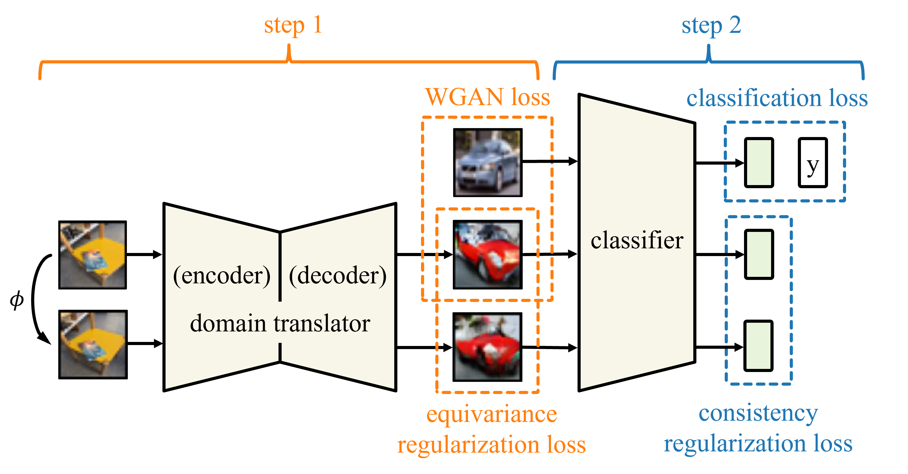

# Learning Unforeseen Robustness from Out-of-distribution Data Using Equivariant Domain Translator

**by [Sicheng Zhu](https://schzhu.github.io/), [Bang An](https://bangann.github.io/), [Furong Huang](http://furong-huang.com/), and [Sanghyun Hong](https://sanghyun-hong.com/)**

**[[ICML23]](https://openreview.net/forum?id=CPQW3uXIa6)**
**[[Poster]](resources/poster.png)**

## About

This paper introduces **TransRobust**, a method for improving model robustness to input image variations. It can learn unforeseen robustness by leveraging out-of-distribution source data and training an auxiliary domain translator that is equivariant to the corresponding data variation. This repository includes the code for the paper.

The figure below shows that **TransRobust** consists of two steps. First, we train an equivariant domain translator, which has a similar structure to image-to-image style transfer models but has an additional objective of preserving the considered data transformation. 
Second, we use the trained domain translator to translate the source images into target-like ones and do consistency training on the translated images to improve model robustness.



## Setup Environment (Optional)

Our default input and output directory is "<project_root>/work_dirs". While you can change it elsewhere, we recommend keeping it as is since our example scripts are based on it. If you don't want to download datasets or directly output files here, you can soft link as follows:

1. Download datasets (you can do nothing and let PyTorch download for itself, too).

   Download datasets to `unforeseen-robustness/workdirs/datasets` or create a symbolic link to an exterior dataset folder:
   ```sh
   ln -s /path/to/downloaded_datasets_folder  /path/to/work_dirs
   ```
2. Set the link to exterior output_dir (Optional)
   ```sh
   ln -s /path/to/exterior_output_dir  /path/to/work_dirs
   ```

Our implementation uses [PyTorch-Ignite](https://pytorch.org/ignite/index.html) as the framework for simplicity and better readability.


## Step 1: Training Domain Translator

Our implementation contains two modules according to the two-step algorithm of **TransRobust**. 
The first module, which trains the domain translator, is located in `<project_dir>/domain_translator`.
This module is exclusively used for **TransRobust**, and not for other baselines.

As an example, we now demonstrate the code usage by training domain translators from SVHN to CIFAR10 under RandAugment Transformations (Figure 4 in the paper). 

First, go to the working directory by
   ```sh
   cd domain_translator
   ```

Then, depending on what equivariance method to use, you can train the domain translator by running one of the following:

- Training **standard** domain translator (w/o equivariance regularization).
   ```sh
   python main.py --dataset_tar cifar10 --dataset_src svhn --transform randaugment --config configs/imgsize32_std.yaml --log_id cifar10_svhn_randaugment_wgan_std
   ```

- Training **equivariant** domain translator (w/ equivariance regularization, using **groundtruth** equivariance loss)
   ```sh
   python main.py --dataset_tar cifar10 --dataset_src svhn --transform randaugment --config configs/imgsize32_groundtruth.yaml --log_id cifar10_svhn_randaugment_wgan_eq_groundtruth 
   ```
  
- Training **equivariant** domain translator (w/ equivariance regularization, using **contrastive** equivariance loss)
   ```sh
   python main.py --dataset_tar cifar10 --dataset_src svhn --transform randaugment --config configs/imgsize32_contrastive.yaml --log_id cifar10_svhn_randaugment_wgan_eq_contrastive
   ```

The `log_id` argument identifies the log and model files to be used later for training classifiers.
The first example will generate the log and model files in `work_dirs/domain_translator/logs/cifar10_svhn_randaugment_wgan_std`.

In this example, we use the `WGAN` framework to encourage the domain translator to generate target-like images (minimizing the Wasserstein distance).
It regularizes the Lipschitz constant of the discriminator by simply clipping the weights, which introduces a hyperparameter `clip_value`. 
Empirically, we observe that a higher `clip_value` allows for generating more target-like images (lower FID) but may hurt the learned equivariance.
You can also choose the `SNGAN` or `WGAN-GP` framework by modifying the yaml configuration files in `configs`. They are slower but often produce visually better results.

As another example, you can replace `dataset_src` with `objectron`, and `transform` with `3d`, to train a domain translator that translates objectron images to resemble CIFAR-10 while preserving 3D viewpint changes.

### Checking Logs and Visualizations

Training results are stored as text logs and Tensorboard logs. The text log is located in 
`<your_log_dir>/log_translator.txt`.
The Tensorboard log, which contains both numerical and visual results, is also located in the same directory and can be viewed by running
   ```sh
   tensorboard --logdir <your_log_dir>
   ```


## Step 2: Training Classifier
The second module of our implementation is for training the robust classifier.
With the trained domain translator in Step 1, you can train the robust classifier by running the following in the project's root folder:
```sh
python main.py --dataset_tar cifar10 --dataset_src svhn --transform randaugment --config configs/transrobust.yaml --translator_name <your_translator_folder_name>
```

For example, to use the **equivariant** domain translator trained with **contrastive** equivariance loss, you can replace `<your_translator_folder_name>` with `cifar10_svhn_randaugment_wgan_eq_contrastive` that we get from step 1.

**TransRobust** introduces two regularization weights as hyperparameters, which you can adjust here.
The weight `w_src` weighs the loss of directly doing consistency training on the source (or equivalently, using the identity domain translator; denoted as $\lambda_2$ in the paper). 
The weight `w_xi` weighs the loss of doing consistency training on the domain translated data (denoted as $\lambda_1$ in the paper).
You can adjust them by modifying the yaml configuration file or by adding them to the Python running command. The latter will overwrite the settings in the yaml config file.

There are other adjustable settings defined in the `main.py` file. For example, you can enhance the foreseen robustness by adding `--aug_tar`, and you can enable training-time out-of-distribution evaluation for CIFAR-10 by adding `--eval_ood`.
   
### Post-Training Evaluations
After training the classifier, you can evaluate its out-of-distribution generalization by
```sh
python evaluate_ood.py --model_dirs <your_pth_model_file_path>
```

And you can evaluate its 3D-viewpoint change robustness using some proxy transformations by
```sh
python evaluate_3d.py --model_dirs <your_pth_model_file_path>
```


## Other Baselines
We have also implemented other baselines for comparison, including
1. ERM
2. Target-domain data augmentation (Oracle)
3. UDA (unsupervised data augmentation, Xie et al. 2020)
4. MBRDL (model-based robust deep learning, Robey et al., 2021)
5. SimCLR (Chen et al. 2020)

You can run these methods as follows:
- ERM:
   ```sh
   python main.py --dataset_tar cifar10 --dataset_src svhn --transform randaugment --config configs/erm.yaml 
   ```
- Target-domain data augmentation (Oracle):
   ```sh
   python main.py --dataset_tar cifar10 --dataset_src svhn --transform randaugment --config configs/oracle.yaml 
   ```
- UDA:
   ```sh
   python main.py --dataset_tar cifar10 --dataset_src svhn --transform randaugment --config configs/uda.yaml 
   ```
- SimCLR:
   ```sh
   python main.py --dataset_tar cifar10 --dataset_src svhn --transform randaugment --config configs/simclr.yaml 
   ```
- MBRDL: Similar to **TransRobust**, MBRDL also requires a two-step training. The first step trains a data augmentation model, which can be done by running
   ```sh
   cd mbrdl
   sh train_munit.sh
   ```
   And the second step trains the classifier using the pretrained augmentation model, which can be done by running the following in the root directory:
   ```sh
   python main.py --dataset_tar cifar10 --dataset_src svhn --transform randaugment --config configs/mbrdl.yaml --mbrdl_model_path <your_mbrdl_model_path>
   ```
  


## Adding New Datasets: Evaluating Dataset Statistics
Since **TransRobust** leverages out-of-distribution source datasets, an important step to facilitate training is to normalize the dataset according to their statistics.
Our implementation enables you to get the mean and standard deviation of a source dataset by running
   ```sh
   python main.py --calculate_src_mean_std --dataset_src <your_source_dataset>
   ```


## Acknowledgements

This project is based on the following open-source projects. We thank their
authors for releasing the source code.

* [MBRDL](https://github.com/arobey1/mbrdl)
* [AugSelf](https://github.com/hankook/AugSelf)
* [multi_illumination](https://github.com/lmurmann/multi_illumination)


If you find our work helpful, please cite it with
```bibtex
@InProceedings{zhu23unforeseen,
  title = 	 {Learning Unforeseen Robustness from Out-of-distribution Data Using Equivariant Domain Translator},
  author =       {Zhu, Sicheng and An, Bang and Huang, Furong and Hong, Sanghyun},
  booktitle = 	 {Proceedings of the 40th International Conference on Machine Learning},
  pages = 	 {42915--42937},
  year = 	 {2023},
  editor = 	 {Krause, Andreas and Brunskill, Emma and Cho, Kyunghyun and Engelhardt, Barbara and Sabato, Sivan and Scarlett, Jonathan},
  volume = 	 {202},
  series = 	 {Proceedings of Machine Learning Research},
  month = 	 {23--29 Jul},
  publisher =    {PMLR},
  pdf = 	 {https://proceedings.mlr.press/v202/zhu23a/zhu23a.pdf},
  url = 	 {https://proceedings.mlr.press/v202/zhu23a.html},
}
```
